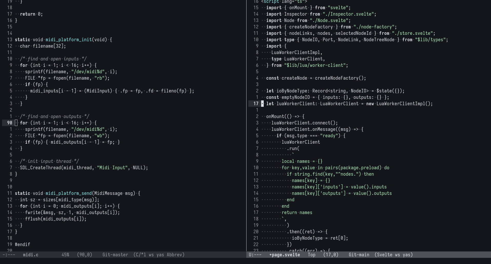

# Emacs Nvim Dark
Emacs theme looks like Neovim default dark theme

I like the neovim's default dark theme.

But I like emacs more.

So I made this theme.. (I couldn't find existing one)

# Preview

